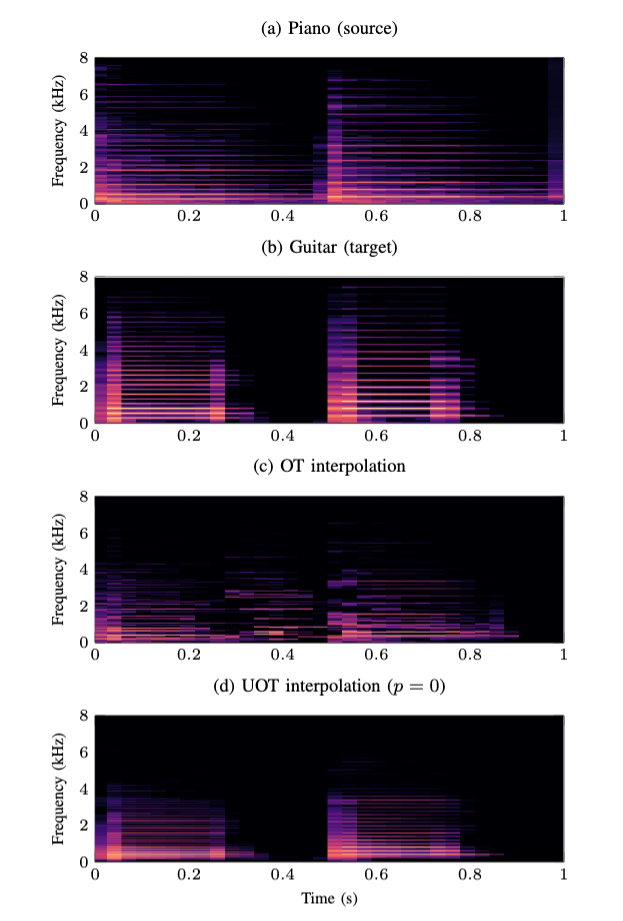

# Audio signal interpolation using optimal transportation of spectrograms

This code implements a novel approach for generating an artificial audio signal that interpolates between given source and target sounds. Our approach relies on the computation of Wasserstein barycenters of the source and target spectrograms, followed by phase reconstruction and inversion. An other contribution is to endow the transportation cost matrix with a specific structure that prohibits remote displacements of energy along the time axis, and for which optimal transport is made possible by leveraging the unbalanced transport framework. 

This code is associated to the paper Audio signal interpolation using optimal transportation of spectrograms. (**link to arxiv**)

You can find an [interactive webpage](https://davidvaldiviad.github.io/audio-signal-interpolation-ot) with interpolations obtained with our proposed methods applied on different types of sounds.

Some results:



# Install

To run the code you must first load the `audio_ot` module:

````
pip install .
````

This will install other dependecies.

# Running

With the provided file `interpolate.py` you can compute an interpolation between two `.wav` files by choosing one of two methods (exact OT vs structured cost matrix + UOT). This will create an interpolation `.wav` file.

How to use:

````
python3 interpolate.py
	path_to_source.wav
	path_to_target.wav
	ot/uot (method)
	--interpolation_path (default source-target-parameters.wav)
	--alpha (interpolation parameter, default 0.5)
	--p (time-limiting parameter, only for uot, default 0)
	--beta (uot hyperparameter, only for uot, default 1)
	--verbose (1 print steps, 2 print computation times)
	--sr (sample rate, default 16kHz)
`````

You can use the files located in examples to test the code.

# Examples

Compute interpolation between a cicada's chirp and flow of water, with exact ot and an interpolation parameter of 80%:


````
python3 interpolate.py examples/cicada.wav examples/water.wav ot --alpha 0.8
````

Compute interpolation between guitar and piano notes with uot, an interpolation parameter of 80%, a time limiting parameter of 1 and a uot hyperparameter of 1 (default). Save it into `interpolation.wav`.

`````
python3 interpolate.py examples/cicada.wav examples/water.wav  uot --interpolation_path interpolation.wav --alpha 0.8 --p 1
`````

You can find more audio examples in the `examples` folder.

# About the code

The functions used for interpolation are located in the folder `audio_ot`. There you can find the following files:

* `audio.py`: load audio recordings, compute spectrograms, ...
* `exact_ot.py`: compute exact OT between normalized spectrograms and interpolate.
* `uot.py`: functions to compute interpolations using the structured cost matrix and UOT.
* `utils.py`: accessory functions, mostly used to compute UOT only on finite entries of the structured cost matrix.